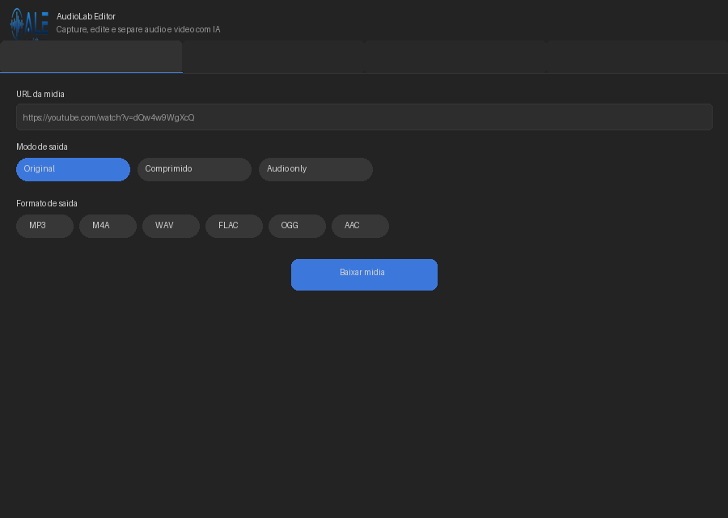

# AudioLab Editor — Apresentação

## Índice

1. [Por que este aplicativo existe](#1-por-que-este-aplicativo-existe)
2. [Para quem ele é](#2-para-quem-ele-e)
3. [O que ele faz](#3-o-que-ele-faz)
4. [Ferramentas internas e como obtê-las](#4-ferramentas-internas-e-como-obte-las)
   - [4.1 yt-dlp — Download de mídia](#41-yt-dlp--download-de-midia)
   - [4.2 FFmpeg + FFprobe — Processamento de áudio e vídeo](#42-ffmpeg--ffprobe--processamento-de-audio-e-video)
   - [4.3 Demucs — Separação de stems por IA](#43-demucs--separacao-de-stems-por-ia)
   - [4.4 faster-whisper — Transcrição de áudio (speech-to-text)](#44-faster-whisper--transcricao-de-audio-speech-to-text)
   - [4.5 edge-tts — Síntese de voz (text-to-speech)](#45-edge-tts--sintese-de-voz-text-to-speech)
5. [CUDA — Aceleração por placa de vídeo NVIDIA](#5-cuda--aceleracao-por-placa-de-video-nvidia)
6. [Rastreio e legalidade no uso do YouTube](#6-rastreio-e-legalidade-no-uso-do-youtube)
7. [Estado atual e próximos passos](#7-estado-atual-e-proximos-passos)
8. [Instalação rápida](#8-instalacao-rapida)

---

## 1. Por que este aplicativo existe

Artistas que trabalham com áudio e vídeo digital — músicos, designers sonoros, videoartistas, podcasteres,
roteiristas — frequentemente precisam de um conjunto recorrente de ferramentas:

- Baixar mídia de URLs para referência ou sample
- Cortar/aparar arquivos de áudio e vídeo
- Separar vozes e instrumentos de uma música (stems)
- Transcrever áudio para texto
- Sintetizar voz a partir de texto

O problema é que cada uma dessas tarefas exige um programa diferente, cada um com sua interface,
seus formatos, suas dependências. O **AudioLab Editor** nasceu de um projeto acadêmico com o objetivo
de reunir essas capacidades em uma única interface gráfica simples, unificando o fluxo de trabalho
de quem lida com mídia todos os dias.

Não é um produto comercial. É uma ferramenta em desenvolvimento, evoluindo como parte de
pesquisas aplicadas em multimídia, processamento de sinais e interação humano-computador.

---

## 2. Para quem ele é

O público-alvo inclui:

- **Músicos e produtores** — que precisam baixar referências, extrair samples, separar stems
- **Designers sonoros e editores de áudio** — que cortam, convertem e organizam arquivos de som
- **Videoartistas e editores de vídeo** — que capturam material da web e fazem cortes rápidos
- **Podcasteres e criadores de conteúdo** — que transcrevem entrevistas e geram voz sintética
- **Estudantes de áudio e multimídia** — que querem explorar ferramentas de IA aplicadas a áudio

Não é necessário saber programar. A interface é gráfica e os parâmetros mais comuns
(qualidade, formato, modo de separação) são controlados por menus e botões.

---

## 3. O que ele faz

| Funcionalidade | Descrição |
|---|---|---|
| **Captura de mídia** | Baixa vídeo ou áudio de URLs (YouTube, Vimeo, etc.) com opções de compressão e extração de áudio |
| **Corte de áudio** | Apara arquivos de áudio definindo tempo inicial e final, exporta em MP3 |
| **Separação de stems** | Usa IA (Demucs) para separar vocais, baixo, bateria e outros instrumentos |
| **Edição de vídeo** | Corta vídeos com presets de qualidade (Alta/Balanceada/Compacta) |
| **Transcrição** | (*em integração*) Converte áudio em texto usando whisper |
| **Voz sintética** | (*em integração*) Gera áudio a partir de texto usando edge-tts |

<p align="center">
  
</p>

---

## 4. Ferramentas internas e como obtê-las

O AudioLab Editor não reinventa a roda: ele orquestra ferramentas consolidadas da indústria
e da academia por trás de uma interface unificada. Abaixo, cada ferramenta, seu papel no aplicativo
e como instalá-la manualmente caso você queira usar fora do app.

---

### 4.1 yt-dlp — Download de mídia

**O que é:** yt-dlp é um programa de linha de comando (fork do youtube-dl) que baixa vídeos e áudios
de mais de 1700 sites: YouTube, Vimeo, SoundCloud, Bandcamp, Twitter/X, TikTok, Twitch, Facebook, etc.

**Papel no AudioLab Editor:**
- Integrado via `YtDlpAdapter` para baixar mídia de URLs
- Obtém metadados antes do download (título, duração, uploader)
- Suporta três modos: vídeo original, vídeo comprimido (via FFmpeg) e somente áudio

#### Instalação

```bash
# Linux / macOS / Windows (com Python)
pip install yt-dlp

# Linux (pacote do sistema)
sudo apt install yt-dlp          # Debian/Ubuntu
sudo pacman -S yt-dlp            # Arch
brew install yt-dlp              # macOS (Homebrew)

# Windows (exe standalone)
# Baixe de: https://github.com/yt-dlp/yt-dlp/releases
# Coloque o .exe em qualquer pasta do PATH
```

#### Uso básico na linha de comando

```bash
# Listar formatos disponíveis
yt-dlp -F "https://youtube.com/watch?v=..."

# Baixar melhor qualidade (vídeo + áudio)
yt-dlp "https://youtube.com/watch?v=..."

# Baixar somente áudio (mp3)
yt-dlp -x --audio-format mp3 "https://youtube.com/watch?v=..."

# Baixar com qualidade específica
yt-dlp -f "bestvideo[height<=1080]+bestaudio/best[height<=1080]" "URL"

# Baixar playlist (limitado a N itens)
yt-dlp --playlist-items 1-5 "URL"

# Baixar legendas
yt-dlp --write-subs --sub-langs pt,en "URL"
```

#### Rastreio e privacidade

O yt-dlp, por si só, **não envia telemetria nem coleta dados do usuário**. Ele é um software
livre e transparente (código-fonte aberto, licença Unlicense). No entanto, o **acesso ao YouTube**
envolve considerações importantes:

| Aspecto | Detalhe |
|---|---|
| **Dados enviados ao Google** | Ao acessar youtube.com, seu IP, User-Agent e cookies (se fornecidos) são visíveis ao Google, como em qualquer visita ao site |
| **Cookies** | O yt-dlp pode usar cookies do seu navegador para acessar conteúdo restrito por idade ou login. Você controla se fornece ou não |
| **Geolocalização** | O YouTube pode aplicar restrições regionais. O yt-dlp respeita essas restrições (não as burla) |
| **Rastreamento** | O yt-dlp não contém trackers. O rastreamento vem do próprio YouTube quando você faz requisições ao servidor |
| **Mitigação** | Use VPN ou Tor se desejar anonimato. O yt-dlp suporta `--proxy` |

#### Legalidade

A legalityade do download de vídeos do YouTube varia por jurisdição e depende do uso:

- **Download para uso pessoal** (referência, sample, backup) — em muitos países é considerado
  uso justo (fair use) ou equivalente, especialmente se você já tem acesso ao conteúdo online
- **Download para redistribuição** — viola os Termos de Serviço do YouTube e pode configurar
  violação de direitos autorais
- **Conteúdo sob licença livre** (Creative Commons, domínio público) — permitido sem restrições
- **Conteúdo próprio** — você pode baixar seus próprios vídeos sem impedimentos

O AudioLab Editor **não incentiva nem promove a pirataria**. A ferramenta de captura existe para
cenários legítimos: baixar samples autorizados, capturar conteúdo próprio, coletar material
para análise acadêmica, ou acessar conteúdo sob licença aberta.

> ⚖ Consulte as leis locais (no Brasil, Lei 9.610/98 — Direitos Autorais) e os
> Termos de Serviço da plataforma antes de fazer download.

---

### 4.2 FFmpeg + FFprobe — Processamento de áudio e vídeo

**O que é:** FFmpeg é o padrão-ouro (e gratuito) para processamento de mídia via linha de comando.
FFprobe é seu companheiro para extrair metadados. Juntos, suportam centenas de codecs, formatos
de container, filtros e operações.

**Papel no AudioLab Editor:**
- `FFmpegAdapter` usa ffmpeg para:
  - Comprimir vídeo (H.264 + AAC) com presets de qualidade (CRF 18–26)
  - Cortar áudio (trim) e exportar como MP3
  - Cortar vídeo com re-encode
- FFprobe é usado para verificar a sanidade dos arquivos e detectar codecs

#### Instalação

```bash
# Linux
sudo apt install ffmpeg           # Debian/Ubuntu
sudo pacman -S ffmpeg             # Arch
sudo dnf install ffmpeg           # Fedora

# macOS
brew install ffmpeg

# Windows
# Baixe de: https://ffmpeg.org/download.html
# Ou via winget: winget install ffmpeg
# Adicione a pasta bin/ ao PATH do sistema
```

#### Verificar instalação

```bash
ffmpeg -version
ffprobe -version
```

#### Uso básico na linha de comando

```bash
# Cortar áudio (dos 30s aos 60s, fade in/out opcionais)
ffmpeg -i entrada.mp3 -ss 30 -to 60 -c copy saida.mp3

# Comprimir vídeo (H.264, qualidade alta)
ffmpeg -i entrada.mp4 -c:v libx264 -crf 18 -preset slow -c:a aac saida.mp4

# Extrair áudio de vídeo
ffmpeg -i video.mp4 -vn -c:a libmp3lame -q:a 2 audio.mp3

# Obter metadados (ffprobe)
ffprobe -v quiet -print_format json -show_format -show_streams arquivo.mp4

# Concatenar arquivos de áudio
ffmpeg -i "concat:parte1.mp3|parte2.mp3" -c copy completo.mp3

# Converter áudio para WAV (útil para Demucs/Whisper)
ffmpeg -i entrada.mp3 -ar 44100 -ac 2 saida.wav
```

#### Uso no AudioLab Editor

No aplicativo, você não precisa digitar nada disso. O FFmpeg roda em segundo plano:

1. Você seleciona "Vídeo comprimido" na aba Captura
2. Escolhe "Alta", "Balanceada" ou "Compacta"
3. O app monta o comando equivalente a `ffmpeg -crf 22 -preset medium ...` automaticamente

---

### 4.3 Demucs — Separação de stems por IA

**O que é:** Demucs é um modelo de deep learning desenvolvido pela Meta (Facebook Research) para
separação de fontes musicais. Ele consegue isolar vocais, baixo, bateria e outros instrumentos
de uma faixa estéreo com qualidade comparável a estúdio.

**Papel no AudioLab Editor:**
- `DemucsSubprocessAdapter` executa o Demucs em segundo plano
- Três modos: apenas vocais, 4 stems (bateria/baixo/vocais/outros), 6 stems (+piano/+guitarra)
- Três formatos de saída: WAV (máxima qualidade), MP3 320kbps (compacto), FLAC (qualidade sem perdas)

#### Instalação

```bash
# Requer Python e PyTorch
# CPU apenas:
pip install demucs

# Com CUDA (NVIDIA, recomendado):
pip install "demucs[torch]"
# Ou instale PyTorch CUDA manualmente:
# pip install torch torchaudio --index-url https://download.pytorch.org/whl/cu121
```

> ⚠ O Demucs baixa automaticamente os modelos (~600 MB) na primeira execução.
> Eles ficam em `~/.cache/torch/hub/checkpoints/`.

#### Uso básico na linha de comando

```bash
# Separar vocais + acompanhamento (2 stems)
demucs --two-stems vocals musica.mp3

# Separar 4 stems (bass, drums, other, vocals) — padrão
demucs musica.mp3

# Separar 6 stems (adiciona piano e guitarra)
demucs -n htdemucs_6s musica.mp3

# Escolher formato de saída
demucs --mp3 --mp3-bitrate 320 musica.mp3
demucs --flac musica.mp3

# Especificar dispositivo (cuda:0 / cpu)
demucs --device cuda:0 musica.mp3
```

A saída vai para `separated/htdemucs/nome_da_musica/` com arquivos individuais.

#### Qualidade e refino

O Demucs oferece diferentes modelos:

| Modelo | Qualidade | Velocidade | Uso |
|---|---|---|---|
| `htdemucs` | Excelente | Rápido | Uso geral, 4 stems, padrão |
| `htdemucs_6s` | Excelente | Médio | 6 stems (piano + guitarra adicionais) |
| `htdemucs_ft` | Superior | Lento | Fine-tuned, melhor separação de vocais |
| `mdx_extra` | Superior | Lento | Alternativa, boa em artefatos |

O modelo `htdemucs` já oferece qualidade profissional. O `htdemucs_ft` adiciona refino
para vocais com ruído de fundo. O `mdx_extra` é melhor quando a música tem muitos
instrumentos sobrepostos.

---

### 4.4 faster-whisper — Transcrição de áudio (speech-to-text)

**O que é:** faster-whisper é uma reimplementação otimizada do Whisper (OpenAI) usando
CTranslate2. Ele transcreve áudio para texto com precisão comparável ao Whismer original,
mas até **4x mais rápido** e usando menos memória.

**Papel no AudioLab Editor:**
- Disponível como dependência opcional (perfil `ai`)
- Integração futura nas abas de áudio e captura

#### Instalação

```bash
pip install faster-whisper
```

#### Uso básico na linha de comando

```python
from faster_whisper import WhisperModel

model = WhisperModel("large-v3", device="cuda", compute_type="float16")
# Ou CPU: model = WhisperModel("base", device="cpu", compute_type="int8")

segments, info = model.transcribe("audio.wav", language="pt")

print(f"Idioma detectado: {info.language} (prob: {info.language_probability:.2f})")

for segment in segments:
    print(f"[{segment.start:.2f}s -> {segment.end:.2f}s] {segment.text}")
```

#### Refino máximo — como obter transcrições de alta qualidade

| Técnica | Descrição | Ganho |
|---|---|---|
| **Modelo grande** | Use `large-v3` em vez de `tiny`/`base`/`small` | Precisão ~30% maior |
| **Idioma explícito** | Passe `language="pt"` em vez de auto-detect | Evita oscilações |
| **VAD (Voice Activity Detection)** | Use `vad_filter=True` para ignorar silêncio | Reduz alucinações |
| **Beam size** | `beam_size=5` melhora decodificação | 1–3% de ganho |
| **Temperature fallback** | `temperature=[0.0, 0.2, 0.4, 0.6, 0.8, 1.0]` | Recupera falhas |
| **Áudio pré-processado** | Passe por Demucs (só vocais) antes de transcrever | Remove ruído musical |
| **Sample rate** | Certifique-se de que o áudio está em 16kHz | Requisito do modelo |
| **Compute type** | `float16` com CUDA, `int8` com CPU | Equilíbrio velocidade/precisão |
| **Alinhamento por palavra** | Use `word_timestamps=True` | Sincronia precisa |

#### O que esses parâmetros significam na prática

- **VAD Filter**: remove trechos sem fala antes de transcrever. Evita que o modelo "invente"
  texto em silêncios ou ruídos.
- **Beam size**: controla quantas hipóteses o modelo considera simultaneamente. Maior =
  mais preciso, mais lento.
- **Temperature fallback**: se o modelo estiver inseguro, tenta com temperaturas mais altas
  (mais "criativo") para evitar travamentos.
- **Compute type `float16`**: usa meia precisão na GPU. Quase tão preciso quanto float32,
  mas consome metade da VRAM.

#### Exemplo com refino máximo

```python
model = WhisperModel(
    "large-v3",
    device="cuda",
    compute_type="float16",
    num_workers=2,
)

segments, info = model.transcribe(
    "audio.wav",
    language="pt",
    beam_size=5,
    vad_filter=True,
    vad_parameters=dict(
        min_silence_duration_ms=500,
        threshold=0.5,
    ),
    temperature=[0.0, 0.2, 0.4, 0.6, 0.8, 1.0],
    word_timestamps=True,
)

for segment in segments:
    for word in segment.words:
        print(f"{word.start:.2f} - {word.end:.2f}: {word.word}")
```

---

### 4.5 edge-tts — Síntese de voz (text-to-speech)

**O que é:** edge-tts é uma biblioteca Python que acessa os servidores de TTS (Text-to-Speech)
da Microsoft Edge, oferecendo vozes naturais em dezenas de idiomas, sem necessidade de
API key ou conta Microsoft.

**Papel no AudioLab Editor:**
- Disponível como dependência opcional (perfil `ai`)
- Geração futura de voz sintética para videomakers, narrações e acessibilidade

#### Instalação

```bash
pip install edge-tts
```

#### Uso básico na linha de comando

```bash
# Listar vozes disponíveis
edge-tts --list-voices

# Gerar áudio a partir de texto
edge-tts --text "Olá, este é um teste de voz sintética." --voice pt-BR-FranciscaNeural --write-media saida.mp3

# Com variação de tom e taxa
edge-tts \
    --text "Texto com entonação personalizada." \
    --voice pt-BR-AntonioNeural \
    --pitch +10Hz \
    --rate +20% \
    --write-media saida.mp3
```

#### Vozes disponíveis em português

| Voz | Gênero | Estilo |
|---|---|---|
| `pt-BR-FranciscaNeural` | Feminino | Natural, padrão |
| `pt-BR-AntonioNeural` | Masculino | Natural, padrão |
| `pt-PT-DuarteNeural` | Masculino | Português de Portugal |
| `pt-PT-RaquelNeural` | Feminino | Português de Portugal |

#### Uso no Python

```python
import edge_tts
import asyncio

async def gerar_voz():
    comunicate = edge_tts.Communicate(
        "Texto a ser sintetizado.",
        "pt-BR-FranciscaNeural",
        pitch="+10Hz",
        rate="+10%",
    )
    await comunicate.save("saida.mp3")

asyncio.run(gerar_voz())
```

---

## 5. CUDA — Aceleração por placa de vídeo NVIDIA

O **CUDA** (Compute Unified Device Architecture) é a plataforma de computação paralela da NVIDIA
que permite que programas usem a GPU para processamento intensivo. Tanto o **Demucs** (separação de stems)
quanto o **faster-whisper** (transcrição) e o **PyTorch** (base dos modelos) se beneficiam enormemente
de uma GPU NVIDIA com CUDA.

### Benefícios

| Cenário | CPU (exemplo) | GPU CUDA (exemplo) | Ganho |
|---|---|---|---|
| Separar 1 música (Demucs htdemucs) | 5–10 min | 15–30 seg | **20×** |
| Transcrever 10 min de áudio (large-v3) | 8–12 min | 1–2 min | **6–8×** |
| Processar lote de 10 músicas | 50–90 min | 3–5 min | **15–20×** |

Outros benefícios:

- **Menos CPU bloqueada** — você pode usar o computador durante o processamento
- **Modelos maiores** — GPUs com 6+ GB VRAM permitem usar `large-v3` (whisper) e `htdemucs_ft`
- **Menor consumo de energia por tarefa** — a GPU termina mais rápido, gastando menos energia total

### Problemas e limitações

| Problema | Detalhe | Mitigação |
|---|---|---|
| **VRAM limitada** | Modelos grandes exigem 4–8 GB de VRAM. Abaixo disso, ocorre `CUDA out of memory` | Use `compute_type="int8"` no whisper, ou `--device cpu` no Demucs |
| **Somente NVIDIA** | CUDA é proprietário da NVIDIA. AMD (ROCm) e Intel (XPU) têm suporte parcial | Sem solução no Windows; no Linux, AMD pode usar ROCm |
| **Instalação complexa** | drivers NVIDIA + CUDA Toolkit + PyTorch CUDA precisam ser compatíveis | Siga os guias abaixo |
| **Consumo elétrico** | GPUs consomem 150–350W em carga | Monitore com `nvidia-smi -l` |
| **Incompatibilidade de versões** | PyTorch 2.x requer CUDA 11.8+; drivers muito antigos falham | Mantenha drivers atualizados |

### Como verificar se você tem CUDA

```bash
# Verificar drivers NVIDIA
nvidia-smi

# Exemplo de saída:
# +-----------------------------------------------------------------------------+
# | NVIDIA-SMI 535.183.01   Driver Version: 535.183.01   CUDA Version: 12.2    |
# +-----------------------------------------------------------------------------+

# Verificar se o PyTorch detecta CUDA
python -c "import torch; print(f'CUDA disponivel: {torch.cuda.is_available()}'); print(f'GPU: {torch.cuda.get_device_name(0) if torch.cuda.is_available() else \"N/A\"}')"
```

### Instalação do CUDA (se necessário)

```bash
# 1. Instalar driver NVIDIA
#    Linux:   sudo apt install nvidia-driver-535   (ou 545, 550)
#    Windows: Baixe de https://www.nvidia.com/geforce/drivers/

# 2. Instalar CUDA Toolkit (opcional, o PyTorch pode vir com runtime próprio)
#    https://developer.nvidia.com/cuda-downloads

# 3. Instalar PyTorch com CUDA
pip install torch torchaudio --index-url https://download.pytorch.org/whl/cu124
# Ajuste cu124 para a versão do seu driver (cu121, cu118, etc.)
```

### Recomendação prática

- **Sem GPU NVIDIA:** Use CPU. É mais lento, mas funciona. O Demucs com `htdemucs` leva
  ~5 min/música em CPUs modernas. O whisper `base` ou `small` rodam bem.
- **Com GPU NVIDIA 4–6 GB VRAM:** Use `float16`. Whisper `large-v3` pode funcionar
  com `compute_type="int8_float16"`. Demucs funciona bem.
- **Com GPU NVIDIA 8+ GB VRAM:** Máximo refino. Whisper `large-v3` com `float16`,
  Demucs `htdemucs_ft`, processamento em lote.

---

## 6. Rastreio e legalidade no uso do YouTube

### O que o AudioLab Editor coleta

**NADA.** O aplicativo não coleta telemetria, não envia dados para servidor externo,
não faz registro de uso, não tem analytics, não tem conta de usuário, não requer cadastro.
Tudo roda localmente na sua máquina.

### O que o YouTube coleta quando você baixa

Ao usar a ferramenta de captura, o AudioLab Editor faz requisições ao YouTube
(ou site da URL fornecida) através do yt-dlp. Para o YouTube, é equivalente a
uma visita normal ao site:

- Seu endereço IP fica visível
- Seu User-Agent (identificação do navegador) é transmitido
- Se você optar por usar cookies (`--cookies-from-browser`), o YouTube pode
  associar o download à sua conta
- O YouTube **não** recebe informação sobre o que você faz com o arquivo baixado

### Diretrizes éticas

O aplicativo foi feito para:

1. **Baixar conteúdo próprio** — vídeos que você mesmo publicou
2. **Fazer backup** — de conteúdo que você tem direito de acesso
3. **Samplear para arte** — com autorização ou sob fair use
4. **Analisar academicamente** — pesquisa, TCC, mestrado

O aplicativo **não** foi feito para:

1. Distribuir conteúdo protegido por direitos autorais
2. Revender downloads
3. Burlar paywalls ou DRM
4. Acessar conteúdo restrito ilegalmente

---

## 7. Estado atual e próximos passos

### Agora (v0.1.0)

- ✅ Captura de mídia com 3 modos (original, comprimido, áudio)
- ✅ Corte de áudio e vídeo
- ✅ Separação de stems (Demucs: vocais, 4 stems, 6 stems)
- ✅ Interface em CustomTkinter (moderna, tema claro/escuro)
- ✅ Organização automática de arquivos por projeto
- ✅ Detecção de dependências na inicialização
- ✅ Build single-file (PyInstaller) para Linux, Windows e macOS
- ✅ CI/CD com GitHub Actions (lint + testes nos 3 SOs)
- ✅ Scripts de instalação para Linux, Windows e macOS
- ✅ Testes de unidade automatizados (32 testes, 100% passando)

### Em desenvolvimento

- 🔄 Transcrição (speech-to-text) com faster-whisper
- 🔄 Síntese de voz (text-to-speech) com edge-tts
- 🔄 OCR em vídeos com PaddleOCR
- 🔄 Melhorias na interface e feedback visual
- 🔄 Suporte a mais formatos e codecs

### Futuro

- ⏳ Processamento em lote
- ⏳ Undo/redo
- ⏳ Plugins / extensões
- ⏳ Versão portátil (Windows/macOS)

---

## 8. Instalação rápida

### Via pip (usuários avançados)

```bash
# Criar ambiente virtual (recomendado)
python -m venv .venv
source .venv/bin/activate   # Linux/macOS
# .venv\Scripts\activate    # Windows

# Instalar com dependências mínimas
pip install audiolab-editor

# Com IA (Demucs + whisper + edge-tts)
pip install "audiolab-editor[ai]"

# Completo (adiciona PaddleOCR)
pip install "audiolab-editor[full]"
```

### Via executável PyInstaller (Linux/macOS)

```bash
# Baixar o binário da página de releases
chmod +x audiolab-editor-linux-x86_64
./audiolab-editor-linux-x86_64
```

### Via executável (Windows)

```powershell
.\audiolab-editor-windows-x86_64.exe
```

### Instalação com integração ao sistema

```bash
# Linux — integração ao menu de aplicativos
./scripts/install.sh

# macOS — bundle .app + atalho no PATH
./scripts/install-macos.sh

# Windows — atalho no Menu Iniciar + PATH
.\scripts\install.ps1
```

### A partir do código-fonte

```bash
pip install -e ".[dev]"
python -m PyInstaller scripts/AudioLabEditor.spec --log-level WARN
# Ou execute diretamente:
python -m src.presentation.main
```

---

> **AudioLab Editor** — um projeto acadêmico do Applied Multimedia Lab.
> Licenciado sob MIT. Use, modifique, estude e compartilhe.
>
> Documentação e código: https://github.com/anomalyco/audiolab-editor
