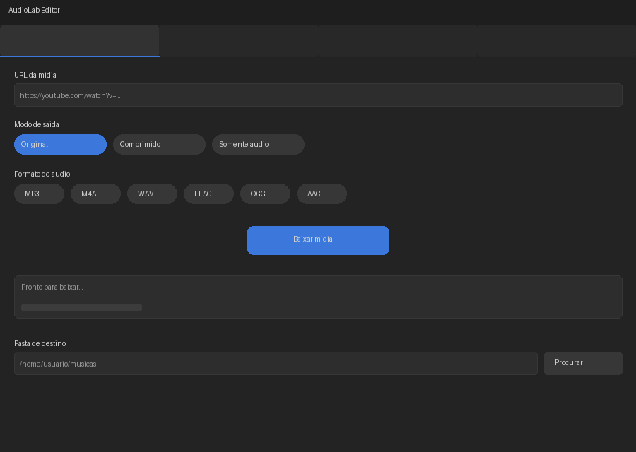
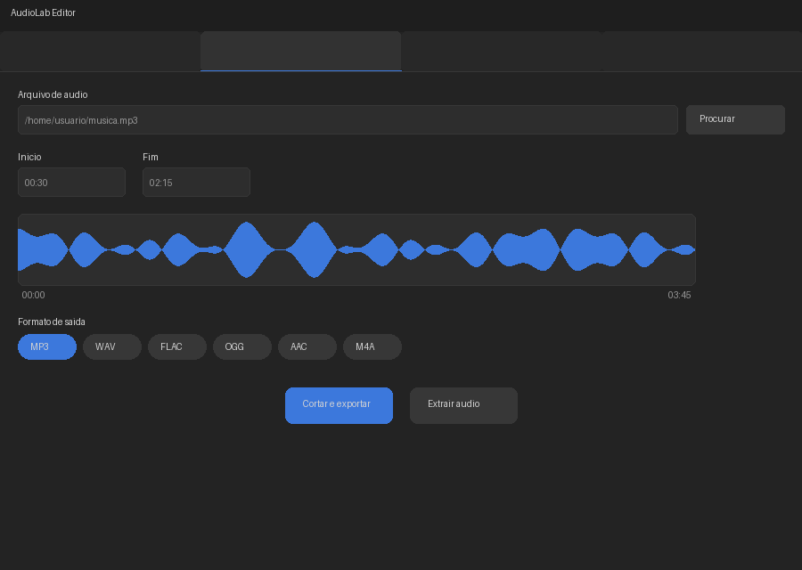
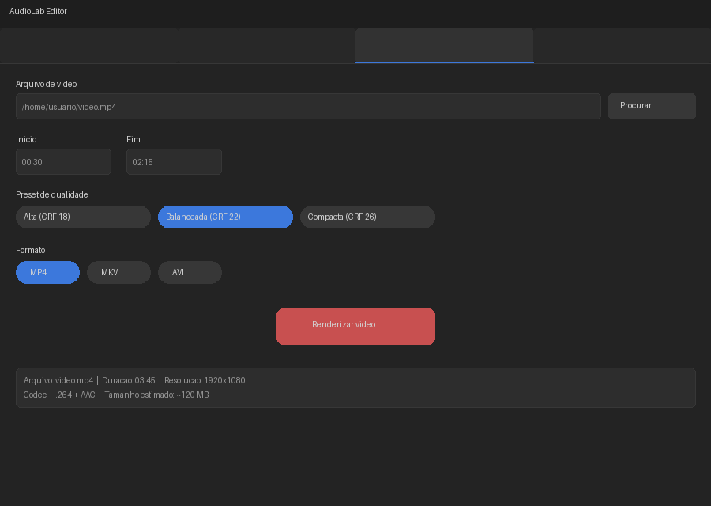
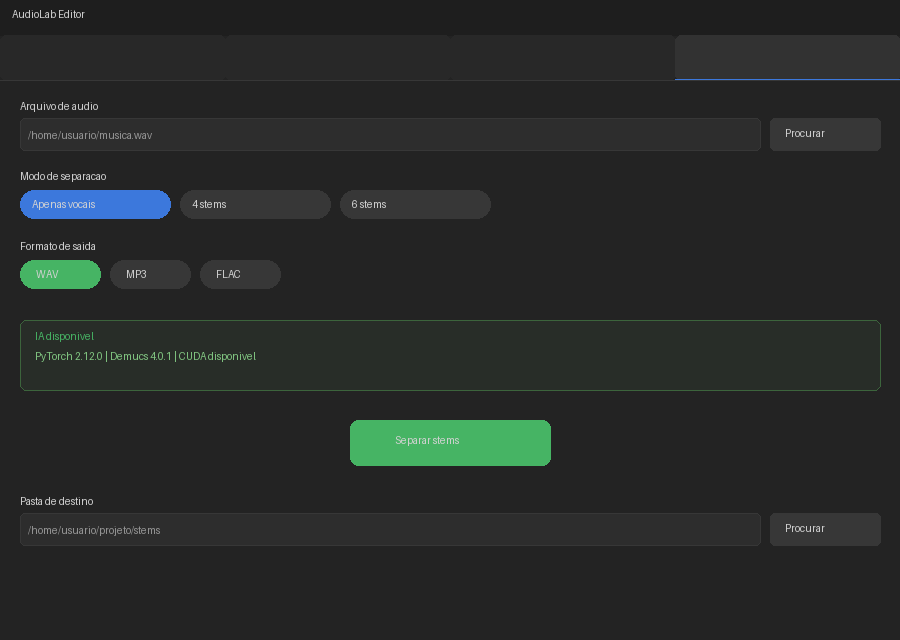

# AudioLab Editor

<p align="center">
  
</p>

<p align="center">
  <strong>Capture, edite e separe áudio e vídeo com IA</strong>
</p>

<p align="center">
  
  
  
  
  
  
  
</p>

---

AudioLab Editor é um aplicativo desktop para **captura**, **corte**, **separação de stems** (fontes sonoras) e **transcrição** de mídia. Construído com Python e CustomTkinter, utiliza IA (Demucs) para separação de instrumentos e vocais, yt-dlp para captura de mídia online e FFmpeg para processamento audiovisual.

Funciona em **Linux**, **Windows** e **macOS**.

---

## Screenshots

<p align="center">
  
  <br/>
  <em>Tela principal — Captura de mídia</em>
</p>

<p align="center">
  
  <br/>
  <em>Aba Captura — download de mídia por URL</em>
</p>

<p align="center">
  
  <br/>
  <em>Aba Corte de Áudio — aparar e exportar áudio</em>
</p>

<p align="center">
  
  <br/>
  <em>Aba Editor de Vídeo — cortar e renderizar vídeo</em>
</p>

<p align="center">
  
  <br/>
  <em>Aba Separador de Stems — isolar vocais e instrumentos com IA</em>
</p>

---

## Funcionalidades

### Captura de Mídia
- Download de vídeo/áudio de URLs (YouTube, Vimeo, etc.) via yt-dlp
- Preservação de qualidade original
- Compressão com presets (Alta / Balanceada / Compacta)
- Extração de áudio em MP3, M4A, WAV, FLAC, OGG, AAC

### Editor de Áudio
- Corte rápido com seleção de início/fim
- Exportação em MP3, WAV, FLAC, OGG, AAC, M4A
- Qualidade ajustável por formato
- Extração de áudio de arquivos de vídeo

### Editor de Vídeo
- Corte com precisão de tempo
- Presets de qualidade (CRF + preset x264)
- Formatos: MP4, MKV, AVI

### Separador de Stems (IA)
- Separação de vocais, baixo, bateria e outros instrumentos
- Modos: apenas vocais, 4 stems, 6 stems
- Formatos de saída: WAV, MP3, FLAC
- Engine: Demucs (Hybrid Transformer Demucs)
- **Sob demanda**: os pacotes de IA são instalados apenas quando o usuário opta por usar o recurso

---

## Downloads

| Plataforma | Arquivo |
|---|---|
| Linux x86_64 | [`audiolab-editor-linux-x86_64`](https://github.com/rubenslyra/AudioLabEditor/releases/latest) |
| Windows x86_64 | [`audiolab-editor-windows-x86_64.exe`](https://github.com/rubenslyra/AudioLabEditor/releases/latest) |
| macOS x86_64 | [`audiolab-editor-macos-x86_64`](https://github.com/rubenslyra/AudioLabEditor/releases/latest) |

> **Nota sobre IA**: Os binários incluem apenas funcionalidades core. Para usar separação de stems, abra a aba **Stems** e clique em "Instalar dependências" — o app baixará torch, Demucs e demais pacotes via pip.

---

## Arquitetura

```
AudioLabEditor/
├── src/
│   ├── domain/          # Entidades, interfaces, DTOs
│   ├── application/     # Casos de uso (orquestração)
│   ├── infrastructure/  # Adaptadores (FFmpeg, yt-dlp, Demucs, runtime)
│   └── presentation/    # UI CustomTkinter (abas, widgets, splash)
├── demucs/              # Código fonte do Demucs v4.1.0a2 (vendado)
├── scripts/             # Build, instalação, dev launcher
└── tests/               # Testes pytest
```

### Princípios
- **Clean Architecture**: domínio isolado, infraestrutura plugável
- **IA sob demanda**: torch, Demucs e dependências são instalados pelo próprio app, não embarcados no binário
- **Lazy loading**: módulos de IA carregados apenas quando necessários
- **Runtime detection**: `AiRuntimeManager` detecta Python, pip e pacotes do sistema

---

## Instalação

### Pré-requisitos
- **Python 3.11+** e **pip** instalados no sistema (necessário apenas para funcionalidades de IA)
- **FFmpeg** (`ffmpeg` e `ffprobe` disponíveis no PATH ou baixados automaticamente pelo app)

### Linux

```bash
# Baixe o binário da última release
chmod +x audiolab-editor-linux-x86_64
./audiolab-editor-linux-x86_64
```

Instalação com integração ao menu de aplicativos:

```bash
./scripts/install.sh
```

### Windows

```powershell
# Baixe o executável da última release
.\audiolab-editor-windows-x86_64.exe
```

Instalação com atalho no Menu Iniciar e PATH:

```powershell
.\scripts\install.ps1                    # instala em %LOCALAPPDATA%
.\scripts\install.ps1 -System            # instala em %ProgramFiles%
```

### macOS

```bash
# Baixe o binário da última release
chmod +x audiolab-editor-macos-x86_64
./audiolab-editor-macos-x86_64
```

Instalação como `.app` bundle (Finder/Launchpad) + atalho no PATH:

```bash
./scripts/install-macos.sh                    # instala em ~/Applications
./scripts/install-macos.sh --system           # instala em /Applications
```

> **Aviso**: No macOS, pode ser necessário autorizar o binário em **Preferências do Sistema > Segurança e Privacidade**. O script `install-macos.sh` gera um bundle `.app` com ícone e Info.plist.

### Desenvolvimento

```bash
git clone https://github.com/rubenslyra/AudioLabEditor.git
cd AudioLabEditor

python3 -m venv .venv
source .venv/bin/activate  # Linux/macOS
# .venv\Scripts\activate   # Windows

pip install -e .
pip install -e ".[ai]"    # opcional, para stems
pip install -e ".[dev]"   # opcional, para desenvolvimento

python src/presentation/main.py
```

---

## Dependências

### Core (embarcadas no binário)

| Pacote | Versão | Função |
|---|---|---|
| Python | 3.14.4 | Runtime |
| CustomTkinter | 5.2.2 | Interface gráfica |
| Pillow | 12.2.0 | Manipulação de imagens |
| yt-dlp | 2026.03.17 | Download de mídia |
| PyInstaller | 6.20.0 | Empacotamento do binário |
| FFmpeg | 8.0.1 | Processamento audiovisual |

### IA (instaladas sob demanda via `pip install`)

| Pacote | Versão | Função |
|---|---|---|
| torch | 2.12.0 | Engine de deep learning |
| torchaudio | 2.11.0 | Processamento de áudio |
| demucs | 4.1.0a2 | Separação de fontes musicais |
| dora-search | 0.1.12 | Framework de configuração |
| julius | 0.2.8 | DSP e aumentação de áudio |
| einops | 0.8.2 | Manipulação tensorial |
| PyYAML | 6.0.3 | Parsing de configuração |
| omegaconf | 2.3.0 | Sistema de configuração |
| numpy | 2.3.5 | Computação numérica |
| tqdm | 4.68.2 | Barras de progresso |
| lameenc | 1.8.2 | Codificação MP3 |
| openunmix | 1.3.0 | Filtragem Wiener |

---

## CI/CD

O projeto usa **GitHub Actions** para integração contínua e releases automatizadas.

### CI
Em cada push/PR, o workflow executa lint (ruff) e testes (pytest) nos 3 sistemas operacionais:


### Release
Ao criar uma tag `v*`, o workflow gera binários para Linux, Windows e macOS e publica automaticamente no GitHub Releases:

```bash
git tag v1.0.0
git push origin v1.0.0
```

Os binários são gerados com PyInstaller em cada plataforma e anexados à release.

---

## Build

### Local

```bash
python -m PyInstaller scripts/AudioLabEditor.spec --log-level WARN
```

O binário inclui apenas funcionalidades core (~132 MB). IA é instalada sob demanda.

---

## Tratamento de Erros

Cada biblioteca/componente do sistema tem cenários de erro mapeados com causas e soluções:

| Componente | Erro | Causa | Tratamento |
|---|---|---|---|
| **yt-dlp** | `DownloadError` | URL inválida ou vídeo removido | try/except com messagebox |
| | `GeoRestrictedError` | Bloqueio regional | Sugerir VPN ao usuário |
| | `NetworkError` | Sem conexão | Aumentar retries (10) e socket_timeout (30) |
| **ffmpeg** | returncode != 0 | Parâmetros inválidos ou codec ausente | Capturar stderr e exibir mensagem clara |
| | `FileNotFoundError` | ffmpeg ausente do PATH | Verificar com `shutil.which()` antes de usar |
| | `TimeoutExpired` | Arquivo muito longo | Usar timeout configurável; permitir cancelamento |
| **PyTorch** | `ImportError` | torch não instalado | Instalar via pip; usar `importlib.find_spec` para detectar |
| | `cuda.OutOfMemoryError` | GPU sem memória | Cair para `device="cpu"` automaticamente |
| | `TorchCodec required` | torchcodec ausente | `pip install torchcodec` |
| **Demucs** | `MissingDependencyError` | torch/demucs ausente | Verificar dependências antes de executar |
| | `EOFError` / truncated data | Checkpoint corrompido | Remover `~/.cache/torch/hub/` e re-baixar |
| | Decompression return code -1 | Binário PyInstaller >2GB | Usar Python diretamente em vez do binário congelado |
| **librosa** | `ImportError` | librosa não instalado | `pip install librosa soundfile` |
| | `soundfile.LibsndfileError` | WAV inválido | Fallback para `audioread` |
| | `ParameterError` | fmin >= fmax em pyin | Validar parâmetros; usar defaults seguros |
| **faster-whisper** | `ImportError` | faster-whisper ausente | `pip install faster-whisper` |
| | Model too large | large-v3 sem RAM suficiente | Cair para modelo menor (base) |
| | sndfile library not found | libsndfile ausente no SO | `sudo apt install libsndfile1` |
| **edge-tts** | `ConnectionError` | Sem internet | Verificar conectividade; informar usuário |
| | returncode 1 | Servidor Microsoft indisponível | Tentar novamente com backoff |
| | `ImportError` | edge-tts ausente | `pip install edge-tts` |
| **customtkinter** | `TclError: invalid command name` | Widget destruído antes de callback | Usar `root.after()`; verificar `winfo_exists()` |
| | `can not find display` | Sem servidor X (Linux headless) | Fallback para modo CLI |
| **NumPy** | `ValueError: broadcasting` | Shapes incompatíveis | Verificar dimensões antes de operações |
| | `ZeroDivisionError` | Divisão por zero em normalização | Usar `max(denominador, 1e-10)` |

> **Documento completo** com exemplos CLI, GUI tkinter e tratamento detalhado de cada biblioteca está em [`AudioLabEditor_Manual_de_Componentes.docx`](./AudioLabEditor_Manual_de_Componentes.docx) e no [wiki do projeto](https://github.com/rubenslyra/AudioLabEditor/wiki/CLI-Stem-Extraction).

---

## Testes

```bash
python -m pytest tests/ -v
```

---

## Licença

MIT License — veja [LICENSE](LICENSE) para detalhes.

---

## Créditos

**Rubens Lyra (Rubinho Lyra)**

Desenvolvedor de software, produtor independente, músico e pesquisador criativo de Vila Velha, Espírito Santo. Atua no desenvolvimento de aplicações multiplataforma, soluções audiovisuais, automações, ferramentas educacionais e projetos voltados à interseção entre tecnologia, música, inteligência artificial e experiência do usuário.

Como desenvolvedor independente, mantém projetos open source e experimentais publicados no GitHub, explorando áreas como engenharia de software, interfaces modernas, processamento de áudio e vídeo, automação de workflows, aplicações desktop e arquitetura de sistemas multiplataforma.

Na área artística e criativa, Rubinho Lyra desenvolve trabalhos autorais como produtor musical, multi-instrumentista e compositor, unindo influências da música brasileira, R&B, Neo Soul, música instrumental, world music e música eletrônica.

Seu trabalho busca aproximar tecnologia, educação, arte e acessibilidade por meio de soluções independentes, experimentais e orientadas à comunidade.

- **Site oficial:** [https://rubinholyra.com.br](https://rubinholyra.com.br)
- **GitHub:** [https://github.com/rubenslyra](https://github.com/rubenslyra)
- **YouTube:** [Rubinho Lyra](https://youtube.com/@rubinholyra)
- **Email:** [rubens.lyra@outlook.com](mailto:rubens.lyra@outlook.com)

---

*AudioLab Editor — mergulhe no som, extraia o que importa.*
